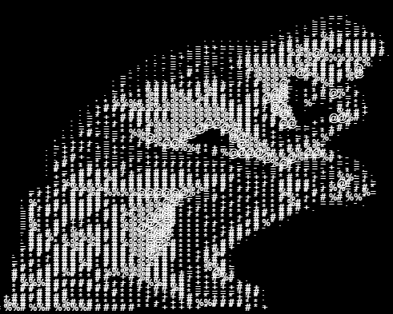

# image-to-ascii

> Simple program to convert images to ascii text  
> Inspired by [The Coding Train](https://www.youtube.com/watch?v=55iwMYv8tGI)

### Dependencies 
- p5.js

### Current implementation works as follows - 
- Load image as a pixel map (RGBA)
- Average the RGB values to form an Average `brightness` value (Luma), essentially converting the image to greyscale
- Map the previously calculated `brightness` values to a character ramp to express brightness in the form of text instead of brightness. Found the `charRamp` [here](https://paulbourke.net/dataformats/asciiart/)

---

>  
Demo run on random image


```
Still a work in progress (WIP)
```